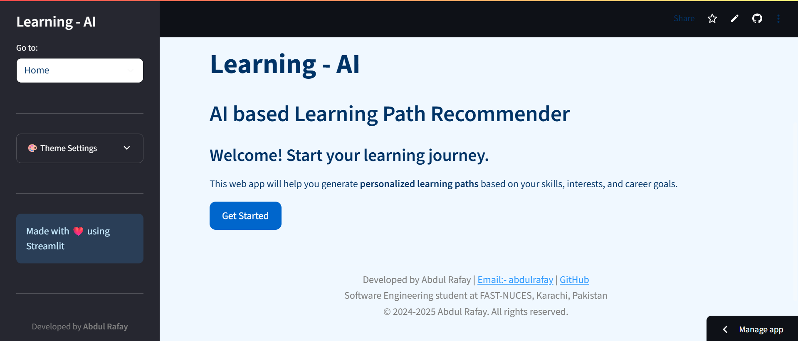

# 🎓 Learning AI - Personalized Learning Path Generator

[](https://www.python.org/downloads/)
[](https://streamlit.io/)
[](https://ai.google.dev/gemini-api)

An intelligent web application that generates personalized learning paths using AI. Built with Streamlit and powered by Google's Gemini API, this app creates customized educational roadmaps based on your skills, goals, and available time.

## Visit

🚀 [https://learning-ai.streamlit.app](https://learning-ai.streamlit.app)


## 📸 Preview



--- 

## ✨ Features

### 🎯 **Personalized Learning Paths**
- AI-powered recommendations based on your profile
- Customized course suggestions with real URLs
- Time-based learning schedules
- Skill-level appropriate content

### 🎨 **Customizable Themes**
- Dark/Light/Auto theme modes
- Custom color picker for personalization
- Quick preset themes (Ocean, Forest, Sunset, Purple)
- Responsive design for all devices

### 📊 **Smart Profile Management**
- Comprehensive user profiling
- Time availability calculator
- Skill assessment and goal setting
- Progress tracking and history

### 🚀 **User Experience**
- Intuitive navigation with sidebar
- Real-time progress indicators
- Celebration effects (balloons, confetti)
- Download learning paths as text files

## 🛠️ Installation

### Prerequisites
- Python 3.8 or higher
- Google Gemini API key

### Setup Instructions

1. **Clone the repository**
   ```bash
   git clone https://github.com/abdulrafay1402/learning-Ai.git
   cd learning-Ai
   ```

2. **Install dependencies**
   ```bash
   pip install -r requirements.txt
   ```

3. **Set up environment variables**
   - Create a `.env` file in the project root
   - Add your Gemini API key:
   ```
   GEMINI_API_KEY=your_actual_api_key_here
   ```

4. **Get your API key**
   - Visit [Google AI Studio](https://makersuite.google.com/app/apikey)
   - Sign in with your Google account
   - Click "Create API Key"
   - Copy the generated key to your `.env` file

5. **Run the application**
   ```bash
   streamlit run Learning_Ai.py
   ```

6. **Open your browser**
   - Navigate to `http://localhost:8501`
   - Start creating your personalized learning path!

## 📱 How to Use

### 1. **Profile Setup**
- Fill in your personal information
- Set your learning goals and current skills
- Configure your available time (hours/day, days/week, weeks available)
- Save your profile to get started

### 2. **Generate Learning Path**
- Click "Get Your Learning Path" after saving your profile
- The AI will analyze your profile and generate a customized roadmap
- Each topic includes course links and time estimates

### 3. **Customize Your Experience**
- Use the theme settings in the sidebar
- Choose from preset themes or create custom colors
- Download your learning path for offline reference

### 4. **Track Progress**
- View your learning history
- Generate new paths as your goals evolve
- Save and compare different learning strategies

## 🎨 Theme Customization

### **Available Themes**
- **Ocean**: Blue theme for a calm learning environment
- **Forest**: Green theme for growth and development
- **Sunset**: Orange theme for creativity and energy
- **Purple**: Purple theme for innovation and technology

### **Custom Colors**
- Primary Color: Main buttons and highlights
- Secondary Color: Sliders and progress bars
- Background Color: Main app background
- Text Color: All text content

## 🔧 Technical Details

### **Built With**
- **Frontend**: Streamlit
- **AI Integration**: Google Gemini API
- **Styling**: Custom CSS with theme support
- **State Management**: Streamlit Session State

### **Key Components**
- **Profile Management**: User data collection and validation
- **AI Prompt Engineering**: Optimized prompts for learning path generation
- **Theme System**: Dynamic CSS with session state persistence
- **Navigation**: Multi-page application with sidebar navigation

### **File Structure**
```
learning-Ai/
├── Learning_Ai.py          # Main application file
├── requirements.txt        # Python dependencies
├── .env                   # Environment variables (create this)
├── .gitignore            # Git ignore rules
├── Logo.jpg              # Application logo
└── README.md             # This file
```

## 🚀 Features in Detail

### **AI-Powered Recommendations**
- Analyzes user profile (age, education, experience, skills)
- Considers available time and learning goals
- Generates 5-6 focused learning topics
- Provides real course URLs from popular platforms
- Respects time constraints and skill levels

### **Smart Validation**
- Required field validation for essential information
- Real-time feedback on missing data
- User-friendly error messages
- Guided form completion

### **Responsive Design**
- Works on desktop, tablet, and mobile devices
- Adaptive layouts for different screen sizes
- Touch-friendly interface elements
- Consistent experience across platforms

## 🤝 Contributing

Contributions are welcome! Please feel free to submit a Pull Request.

### **How to Contribute**
1. Fork the repository
2. Create a feature branch (`git checkout -b feature/AmazingFeature`)
3. Commit your changes (`git commit -m 'Add some AmazingFeature'`)
4. Push to the branch (`git push origin feature/AmazingFeature`)
5. Open a Pull Request

## 📄 License

This project is for academic and institutional use. Credit the developers if reused or modified for deployment.

## 👨‍💻 Developer

**Abdul Rafay**
- **Email**: abdulrafay14021997@gmail.com
- **GitHub**: [@abdulrafay1402](https://github.com/abdulrafay1402)
- **Education**: Software Engineering student at FAST-NUCES, Karachi, Pakistan

## 🙏 Acknowledgments

- **Streamlit** for the amazing web framework
- **Google Gemini API** for powerful AI capabilities
- **Open Source Community** for inspiration and support

## 📞 Support

If you encounter any issues or have questions:
- Create an issue on GitHub
- Email: abdulrafay14021997@gmail.com
- Check the documentation for common solutions

---

⭐ **Star this repository if you found it helpful!**

Made with ❤️ by Abdul Rafay 
